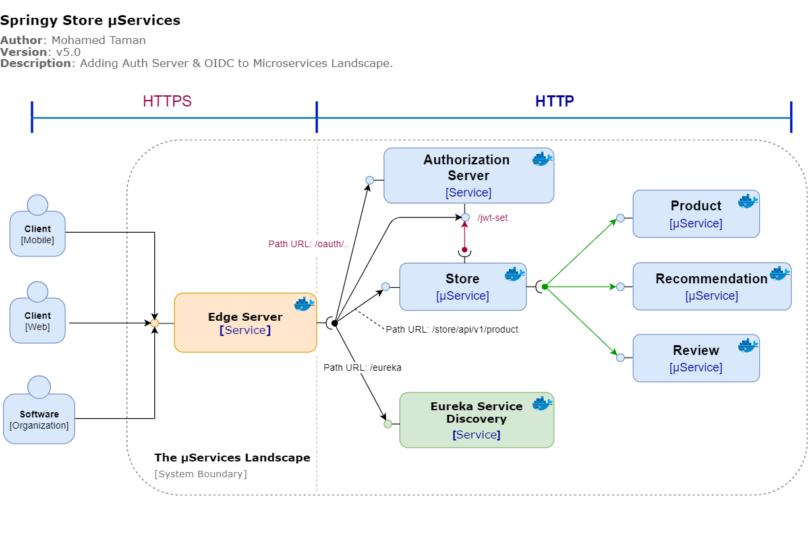
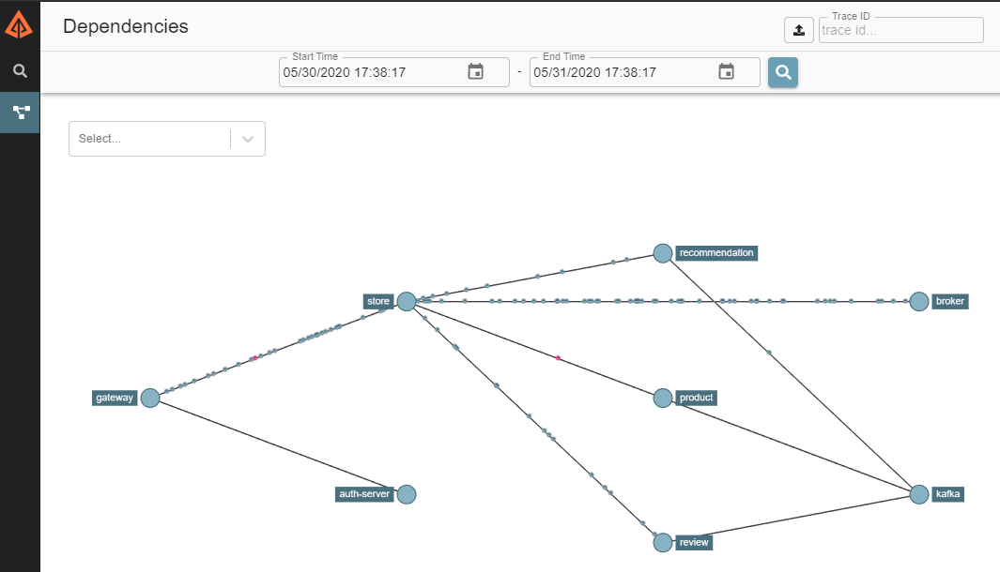

# Springy Store μServices  [](https://github.com/mohamed-taman/Springy-Store-Microservices/releases) | [](https://twitter.com/_tamanm)

## Important Note: This project's new milestone is to move The whole system to work on Kubernetes, so stay tuned.

## Introduction
- This project is a development of a small set of **Spring Boot** and **Cloud** based Microservices projects that implement cloud-native intuitive, Reactive Programming, Event-driven, Microservices design patterns, and coding best practices.
- The project follows [**CloudNative**](https://www.cncf.io/) recommendations and The [**twelve-factor app**](https://12factor.net/) methodology for building *software-as-a-service apps* to show how μServices should be developed and deployed.
- This project uses cutting edge technologies like Docker, Kubernetes, Elasticsearch Stack for
 logging and monitoring, Java SE 15, MySQL, and MongoDB databases, all components developed with TDD in mind, covering integration & performance testing, and many more.
 - This project is going to be developed as stages, and all such stage steps are documented under
  the project **Springy Store μServices** [wiki page](https://github.com/mohamed-taman/Springy-Store-Microservices/wiki).
---
## Getting started
### System components Structure
Let's explain first the system structure to understand its components:
```
Springy Store μService --> Parent folder. 
|- config --> All system configuration files 
|- docs --> All docs and diagrams. 
|- store-base 
  |- store-build-chassis --> Super Parent POM, contains all build information 
  |- store-cloud-chassis --> Cloud services Parent POM, inherit from build contains all cloud libraries 
  |- store-service-chassis --> Parent POM, inherits from cloud contains all microservices common libraries 
|-store-cloud-infra 
  |- authorization-server --> Authorization server
  |- edge-server --> API Gateway server
  |- eureka-server --> Service discovery server
  |- config-server --> Centralized Configuration server
|-store-common 
  |- store-api --> API Endpoint and services definitions for all microservices 
  |- store-utils --> Common utilities shared between all components 
|-store-services 
  |- product-service --> Product Microservice 
  |- recommendation-service --> Recommendation Microservice 
  |- review-service --> Review Microservice 
  |- store-service --> Store Microservice 
|- docker-compose.yml --> contains all services landscape with RabbitMQ 
|- docker-compose-kafka.yml --> contains all services landscape with more instances working with Kafka with partitions 
|- docker-compose-partitions.yml --> contains all services landscape with more instances working with RabbitMQ with partitions 
|- run-em-all.sh --> Run all microservices in separate mode. 
|- setup.sh --> Install all shared POMs and shared libraries. 
|- stop-em-all.sh --> Stop all services runs in standalone mode. 
|- test-em-all.sh --> This will start all docker compose landscape and test them, then shutdown docker compose containers with test finishes (use switch start stop)
```
Now, as we have learned about different system components, then let's start.

### System Boundary - μServices Landscape



### Required software

The following are the initially required software pieces:

1. **Maven**: Apache Maven is a software project management and comprehension tool, it can be downloaded from here https://maven.apache.org/download.cgi

1. **Git**: it can be downloaded and installed from https://git-scm.com/downloads

1. **Java 15 EA**: it can be downloaded and installed from https://jdk.java.net/15/

1. **curl**: this command-line tool for testing HTTP-based APIs can be downloaded and installed from https://curl.haxx.se/download.html

1. **jq**: This command-line JSON processor can be downloaded and installed from https://stedolan.github.io/jq/download/

1. Spring Boot Initializer: This *Initializer* generates *spring* boot project with just what you need to start quickly! Start from here https://start.spring.io/

6. **Docker Desktop**: The fastest way to containerize applications on your desktop, and you can download it from here [https://www.docker.com/products/docker-desktop](https://www.docker.com/products/docker-desktop)

   > For each future stage, I will list the newly required software. 

Follow the installation guide for each software website link and check your software versions from the command line to verify that they are all installed correctly.

## Using an IDE

I recommend that you work with your Java code using an IDE that supports the development of Spring Boot applications such as Spring Tool Suite or IntelliJ IDEA Ultimate Edition. So you can use the Spring Boot Dashboard to run the services, run each microservice test case, and many more.

All that you want to do is just fire up your IDE **->** open or import the parent folder `springy-store-microservices,` and everything will be ready for you.

## Playing With Springy Store Project

### Cloning It

The first thing to do is to open **git bash** command line, and then simply you can clone the project under any of your favorite places as the following:

```bash
> git clone https://github.com/mohamed-taman/Springy-Store-Microservices.git
```

### Build & Test Them In Isolation

To build and run the test cases for each service & shared modules in the project, we need to do the following:

#### First: Build & Install Shared Dependencies

> This done only for the first time or any new changes or versions of shared modules and POMs.

To build and install `store-build-chassis`, `store-utils`, `store-api`, `store-services-chassis`, and `store-cloud-chassis` libraries, from the root folder `springy-store-microservices` run the
 following commands:

```bash
mohamed.taman@DTLNV8 ~/springy-store-microservices 
λ ./setup.sh
```

Now you should expect output like this:

```bash
Installing all Springy store core shared modules & Parent POMs
...............................................................

1- Installing [Parent Build Chassis] module...
Done successfully.

2- Installing [Parent Cloud Chassis] module...
Done successfully.

3- Installing shared [Services Utilities] module...
Done successfully.

4- Installing shared [Services APIs] module...
Done successfully.

5- Installing [Services Parent Chassis] module...
Done successfully.

Woohoo, building & installing all project modules are finished successfully.
The project is ready for the next step. :)
```
#### Second: Build & Test Microservices
Now it is the time to build our **4 microservices** and run each service integration test in
 isolation by running the following commands:

```bash
mohamed.taman@DTLNV8 ~/springy-store-microservices 
λ ./mvnw clean verify -Ddockerfile.skip
```

All build commands and test suite for each microservice should run successfully, and the final output should be like this:

```bash
---------------< com.siriusxi.ms.store:store-aggregator >---------------
[INFO] Building Springy Store Aggregator 1.0-SNAPSHOT                   [13/13]
[INFO] --------------------------------[ pom ]---------------------------------
[INFO]
[INFO] --- maven-clean-plugin:2.5:clean (default-clean) @ store-aggregator ---
[INFO] ------------------------------------------------------------------------
[INFO] Reactor Summary for Springy Store Aggregator 1.0-SNAPSHOT:
[INFO]
[INFO] Springy Store Build Chassis ........................ SUCCESS [  0.228 s]
[INFO] Springy Store Cloud Chassis ........................ SUCCESS [  1.257 s]
[INFO] Store APIs ......................................... SUCCESS [  4.279 s]
[INFO] Store Utils ........................................ SUCCESS [  1.809 s]
[INFO] Springy Store Chassis .............................. SUCCESS [  0.857 s]
[INFO] Product Service .................................... SUCCESS [ 13.079 s]
[INFO] Review Service ..................................... SUCCESS [  9.332 s]
[INFO] Recommendation Service ............................. SUCCESS [  8.463 s]
[INFO] Store Service ...................................... SUCCESS [  8.927 s]
[INFO] Eureka Discovery Server ............................ SUCCESS [  6.536 s]
[INFO] Edge Server ........................................ SUCCESS [ 32.108 s]
[INFO] Authorization Server ............................... SUCCESS [  1.616 s]
[INFO] Configuration Server ............................... SUCCESS [  1.216 s]
[INFO] Springy Store Aggregator ........................... SUCCESS [  0.100 s]
[INFO] ------------------------------------------------------------------------
[INFO] BUILD SUCCESS
[INFO] ------------------------------------------------------------------------
[INFO] Total time:  57.663 s
[INFO] Finished at: 2020-05-08T03:38:34+02:00
[INFO] ------------------------------------------------------------------------
```

### Running Them All
#### Using RabbitMQ without the use of partitions
Now it's the time to run all of our reactive Microservices, and it's straightforward just run the following `docker-compose` commands:

```bash
mohamed.taman@DTLNV8 ~/springy-store-microservices 
λ docker-compose -p ssm up -d
```

All the **services**, **databases**, and **messaging service** will run in parallel in detach mode (option `-d`), and command output will print to the console the following:

```bash
Creating network "ssm_default" with the default driver
Creating ssm_eureka_1         ... done
Creating ssm_config-server_1  ... done
Creating ssm_gateway_1        ... done
Creating ssm_auth-server_1    ... done
Creating ssm_mysql_1          ... done
Creating ssm_mongodb_1        ... done
Creating ssm_rabbitmq_1       ... done
Creating ssm_zipkin_1         ... done
Creating ssm_store_1          ... done
Creating ssm_review_1         ... done
Creating ssm_product_1        ... done
Creating ssm_recommendation_1 ... done
```
### Access Store APIs
You can manually test `Store Service` APIs throughout its **Swagger** interface at the following
 URL [https://localhost:8443/swagger-ui.html](https://localhost:8443/swagger-ui.html).
### Access Service Discovery Server (Eureka)
If you would like to access the Eureka service discovery point to this URL [http://localhosts:8443/eureka/web](https://localhost:8443/eureka/web) to see all the services registered inside it. 

Note that it is accessed through API Gateway and is secured. Therefore the browser will ask you for `username:mt` and `password:p,` write them to the dialog, and you will access it. This type of security is a **basic form security**.

The **API Gateway** and **Store Service** both act as a *resource server*. To know more about calling Store API in a secure way you can check the `test-em-all.sh` script on how I have changed the calling of the services using **OAuth2** security.

### Access RabbitMQ
In browser point to this URL [http://localhost:5672/](http://localhost:5672/) `username: guest` and `password: guest`, and you can see all **topics**, **DLQs**, **partitions**, and payload.

1. For running two instances of each service and using _RabbitMQ with two partitions per topic_, use the following `docker-compose` command:
     ```bash
     mohamed.taman@DTLNV8 ~/springy-store-microservices 
     λ docker-compose -p ssm -f docker-compose-partitions.yml up -d 
     ```
 1. To use _Kafka and Zookeeper with two partitions per topic_ run the following command:
     ```bash
      mohamed.taman@DTLNV8 ~/springy-store-microservices 
      λ docker-compose -p ssm -f docker-compose-kafka.yml up -d
     ```
#### Check All Services Health
From Store front Service we can check all the core services health when you have all the
 microservices up and running using Docker Compose,
```bash
mohamed.taman@DTLNV8 ~/springy-store-microservices 
λ curl -k https://localhost:8443/actuator/health -s | jq .components."\"Core Microservices\""
```
This will result in the following response:
```json
{
  "status": "UP",
  "components": {
    "Authorization Server": {
      "status": "UP"
    },
    "Product Service": {
      "status": "UP"
    },
    "Recommendation Service": {
      "status": "UP"
    },
    "Review Service": {
      "status": "UP"
    },
    "Store Service": {
      "status": "UP"
    }
  }
}
```
### Testing Them All
Now it's time to test all the application functionality as one part. To do so just run
 the following automation test script:

```bash
mohamed.taman@DTLNV8 ~/springy-store-microservices 
λ ./test-em-all.sh start
```
> You can use `stop` switch with `start`, that will 
>1. start docker, 
>2. run the tests, 
>3. stop the docker instances.

The result will look like this:

```bash
Starting 'Springy Store μServices' for [Blackbox] testing...

Start Tests: Tue, May 31, 2020 2:09:36 AM
HOST=localhost
PORT=8443
Restarting the test environment...
$ docker-compose -p ssm down --remove-orphans
$ docker-compose -p ssm up -d
Wait for: curl -k https://localhost:8443/actuator/health... , retry #1 , retry #2, {"status":"UP"} DONE, continues...
Test OK (HTTP Code: 200)
...
Test OK (actual value: 1)
Test OK (actual value: 3)
Test OK (actual value: 3)
Test OK (HTTP Code: 404, {"httpStatus":"NOT_FOUND","message":"No product found for productId: 13","path":"/store/api/v1/products/13","time":"2020-04-12@12:34:25.144+0000"})
...
Test OK (actual value: 3)
Test OK (actual value: 0)
Test OK (HTTP Code: 422, {"httpStatus":"UNPROCESSABLE_ENTITY","message":"Invalid productId: -1","path":"/store/api/v1/products/-1","time":"2020-04-12@12:34:26.243+0000"})
Test OK (actual value: "Invalid productId: -1")
Test OK (HTTP Code: 400, {"timestamp":"2020-04-12T12:34:26.471+00:00","path":"/store/api/v1/products/invalidProductId","status":400,"error":"Bad Request","message":"Type mismatch.","requestId":"044dcdf2-13"})
Test OK (actual value: "Type mismatch.")
Test OK (HTTP Code: 401, )
Test OK (HTTP Code: 200)
Test OK (HTTP Code: 403, )
Start Circuit Breaker tests!
Test OK (actual value: CLOSED)
Test OK (HTTP Code: 500, {"timestamp":"2020-05-26T00:09:48.784+00:00","path":"/store/api/v1/products/2","status":500,"error":"Internal Server Error","message":"Did not observe any item or terminal signal within 2000ms in 'onErrorResume' (and no fallback has been configured)","requestId":"4aa9f5e8-119"})
...
Test OK (actual value: Did not observe any item or terminal signal within 2000ms)
Test OK (HTTP Code: 200)
Test OK (actual value: Fallback product2)
Test OK (HTTP Code: 200)
Test OK (actual value: Fallback product2)
Test OK (HTTP Code: 404, {"httpStatus":"NOT_FOUND","message":"Product Id: 14 not found in fallback cache!","path":"/store/api/v1/products/14","timestamp":"2020-05-26@00:09:53.998+0000"})
...
Test OK (actual value: product name C)
Test OK (actual value: CLOSED)
Test OK (actual value: CLOSED_TO_OPEN)
Test OK (actual value: OPEN_TO_HALF_OPEN)
Test OK (actual value: HALF_OPEN_TO_CLOSED)
End, all tests OK: Tue, May 31, 2020 2:10:09 AM
```
### Tracking the services with Zipkin
Now, you can now track Microservices interactions throughout Zipkin UI from the following link:
[http://localhost:9411/zipkin/](http://localhost:9411/zipkin/)


### Closing The Story

Finally, to close the story, we need to shut down Microservices manually service by service, hahaha just kidding, run the following command to shut them all:

```bash
mohamed.taman@DTLNV8 ~/springy-store-microservices 
λ docker-compose -p ssm down --remove-orphans
```
 And you should see output like the following:

```bash
Stopping ssm_recommendation_1 ... done
Stopping ssm_product_1        ... done
Stopping ssm_review_1         ... done
Stopping ssm_mongodb_1        ... done
Stopping ssm_store_1          ... done
Stopping ssm_auth-server_1    ... done
Stopping ssm_mysql_1          ... done
Stopping ssm_rabbitmq_1       ... done
Stopping ssm_eureka_1         ... done
Stopping ssm_gateway_1        ... done
Stopping ssm_config-server_1  ... done
Stopping ssm_zipkin_1         ... done
Removing ssm_recommendation_1 ... done
Removing ssm_product_1        ... done
Removing ssm_review_1         ... done
Removing ssm_mongodb_1        ... done
Removing ssm_store_1          ... done
Removing ssm_auth-server_1    ... done
Removing ssm_mysql_1          ... done
Removing ssm_rabbitmq_1       ... done
Removing ssm_eureka_1         ... done
Removing ssm_gateway_1        ... done
Removing ssm_config-server_1  ... done
Removing ssm_zipkin_1         ... done
Removing network ssm_default
```
### The End
In the end, I hope you enjoyed the application and find it useful, as I did when I was developing it. 
If you would like to enhance, please: 
- **Open PRs**, 
- Give **feedback**, 
- Add **new suggestions**, and
- Finally, give it a 🌟.

*Happy Coding ...* 🙂

# License
Copyright (C) 2017-2020 Mohamed Taman, Licensed under the MIT License.
