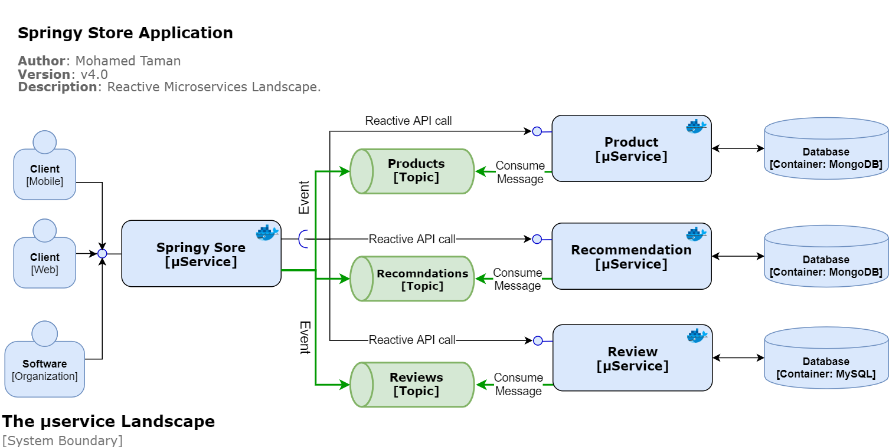

# Springy Store μServices

- This project is a development of a small set of **Spring Boot** and **Cloud** based Microservices projects, that implement cloud-native intuitive, Reactive Programming, Event-driven, Microservices design patterns and coding best practices.
- The project follows [**CloudNative**](https://www.cncf.io/) recommendations and The [**twelve-factor app**](https://12factor.net/) methodology for building *software-as-a-service apps* to show how μServices should be built and deployed.
- This project is using cutting edge technologies like Docker, Kubernetes, Elasticsearch Stack for logging and monitoring, Java SE 14, MySQL, and MongoDB databases, all components developed with TDD in mind, covering integration & performance testing, and many more.

------
I am developing this project as stages, and all such stages are documented under project
 **Springy Store μServices** [wiki page](https://github.com/mohamed-taman/Springy-Store-Microservices/wiki). Each of such stage will be a release in its own, so you can go back and
 forward between releases to see the differences and how adding things solve specific problems we face.

<u>For example;</u> in the first stage (1st release) I just created project structure, basic services' skeleton, integration between them, and finally write integration testing as well as semi-automated testing for the whole services' functionality.

At the 1st stage the **Recommendation** and **Review** microservices generate local in-memory data and **Store Service** calls the other three services (*Product*, *Recommendation*, and *Review*) statically to generate client aggregate response for a specific product. Therefore, in: 

- The second stage I will introduce **database integration**, then in (***done***)
- The third stage I will introduce **Dockerization** of our services and **docker-compose**, and in (***done***)
- The fourth stage I will introduce **service discovery**, and so on.

## System components Structure
Let's explain first the system structure to understand its components:


Now as we have learned about different system components, then let's start.

## Getting started

The first stage aka (**Release v1.0**) is about creating and implementing a set of project Microservices.

### Creating a Set of Cooperating Microservices (Release v1.0)

The following topics are going to be covered in this 1st stage (other stages topics to be documented
 in a
 project wiki):

- Introducing the microservice landscape.
- Generating skeleton microservices.
- Adding RESTful APIs.
- Adding a **Store**, **Product**, **Recommendation**, and **Review** microservices.
- Adding error handling.
- Testing the APIs manually.
- Adding automated tests of microservices in isolation.
- Adding semi-automated tests to a microservice landscape.

### System Boundary - μServices Landscape (Release 4.5-Latest)



### Required software

The following are the initially required software pieces:

1. **Git**: it can be downloaded and installed from https://git-scm.com/downloads.

2. **Java 14**: it can be downloaded and installed from https://www.oracle.com/technetwork/java/javase/downloads/index.html.

3. **curl**: this command-line tool for testing HTTP-based APIs can be downloaded and installed from https://curl.haxx.se/download.html.

4. **jq**: This command-line JSON processor can be downloaded and installed from https://stedolan.github.io/jq/download/.

5. Spring Boot Initializer: This *Initializer* generates *spring* boot project with just what you need to start quickly! start from here https://start.spring.io/.

6. **Docker Desktop**: The fastest way to containerize applications on your desktop, and you can download it from here [https://www.docker.com/products/docker-desktop](https://www.docker.com/products/docker-desktop)

   > For each future stage, I will list the newly required software. 

Follow the installation guide for each software website and check your software versions from the command line to verify that they are installed correctly.

## Using an IDE

I recommend that you work with your Java code using an IDE that supports the development of Spring Boot applications such as Spring Tool Suite or IntelliJ IDEA Ultimate Edition. So you can use the Spring Boot Dashboard to run the services, run each microservice test case and many more.

All that you want to do is just fire up your IDE **->** open or import the parent folder `springy-store-microservices` and everything will be ready for you.

## Playing With Springy Store Project

### Cloning It

First open **git bash** command line, then simply you can clone the project under any of your favorite places as the following:

```bash
> git clone https://github.com/mohamed-taman/Springy-Store-Microservices.git
```

### Build & Test Them In Isolation

To build and run test cases for each service & shared modules in the project we need to do the following:

#### First: Build & Install Shared Dependencies

> This done only for the first time or any new changes or versions of shared modules and POMs.

To build and install `store-build-chassis`, `store-utils`, `store-api`, `store-chassis` libraries, from the root folder `springy-store-microservices` run the following commands:

```bash
mohamed.taman@DTLNV8 ~/springy-store-microservices 
λ ./setup.sh
```

Now you should expect output like this:

```bash
Installing all Springy store core shared modules & Parent POMs
...............................................................

1- Installing [Parent Build Chassis] module...
Done successfully.

2- Installing [Parent Cloud Chassis] module...
Done successfully.

3- Installing shared [Services Utilities] module...
Done successfully.

4- Installing shared [Services APIs] module...
Done successfully.

5- Installing [Services Parent Chassis] module...
Done successfully.

Woohoo, building & installing all project modules are finished successfully.
The project is ready for the next step. :)
```
#### Second: Build & Test Microservices
Now it is time to build our **4 microservices** and run each service integration test in
 isolation by running the following commands:

```bash
mohamed.taman@DTLNV8 ~/springy-store-microservices 
λ ./mvnw clean verify -Ddockerfile.skip
```

All build commands and test suite for each microservice should run successfully, and the final output should be like this:

```bash
---------------< com.siriusxi.ms.store:store-aggregator >---------------
[INFO] Building Springy Store Aggregator 1.0-SNAPSHOT                   [11/11]
[INFO] --------------------------------[ pom ]---------------------------------
[INFO]
[INFO] --- maven-clean-plugin:2.5:clean (default-clean) @ store-aggregator ---
[INFO] ------------------------------------------------------------------------
[INFO] Reactor Summary for Springy Store Aggregator 1.0-SNAPSHOT:
[INFO]
[INFO] Springy Store Build Chassis ........................ SUCCESS [  0.228 s]
[INFO] Springy Store Cloud Chassis ........................ SUCCESS [  1.257 s]
[INFO] Store APIs ......................................... SUCCESS [  4.279 s]
[INFO] Store Utils ........................................ SUCCESS [  1.809 s]
[INFO] Springy Store Chassis .............................. SUCCESS [  0.857 s]
[INFO] Product Service .................................... SUCCESS [ 13.079 s]
[INFO] Review Service ..................................... SUCCESS [  9.332 s]
[INFO] Recommendation Service ............................. SUCCESS [  8.463 s]
[INFO] Store Service ...................................... SUCCESS [  8.927 s]
[INFO] Eureka Discovery Server ............................ SUCCESS [  6.536 s]
[INFO] Springy Store Aggregator ........................... SUCCESS [  0.100 s]
[INFO] ------------------------------------------------------------------------
[INFO] BUILD SUCCESS
[INFO] ------------------------------------------------------------------------
[INFO] Total time:  55.663 s
[INFO] Finished at: 2020-04-26T03:38:34+02:00
[INFO] ------------------------------------------------------------------------
```

### Running Them All
#### Using RabbitMQ without the use of partitions
Now it's the time to run all of our reactive Microservices, and it's very simple just run the following `docker-compose` commands:

```bash
mohamed.taman@DTLNV8 ~/springy-store-microservices 
λ docker-compose -p ssm up -d
```

All the **services**, **databases**, and **messaging service** will run in parallel in detach mode (option `-d`), and command output will print to the console the following:

```bash
Creating network "ssm_default" with the default driver
Creating ssm_eureka_1         ... done
Creating ssm_mysql_1          ... done
Creating ssm_mongodb_1        ... done
Creating ssm_rabbitmq_1       ... done
Creating ssm_store_1          ... done
Creating ssm_review_1         ... done
Creating ssm_product_1        ... done
Creating ssm_recommendation_1 ... done
```

### Access Store APIs
You can manually test `Store Service` APIs throughout its **Swagger** interface at the following
 URL [http://localhost:8080/swagger-ui.html](http://localhost:8080/swagger-ui.html).
#### Access RabbitMQ
In browser point to this URL [http://localhost:5672/](http://localhost:5672/) `username: guest` and `password: guest`, and you can see all **topics**, **DLQs**, **partitions**, and payload.

1. For running 2 instances of each service and using _RabbitMQ with two partitions per topic_, use the following `docker-compose` command:
     ```bash
     mohamed.taman@DTLNV8 ~/springy-store-microservices 
     λ docker-compose -p ssm -f docker-compose-partitions.yml up -d 
     ```
 1. To use _Kafka and Zookeeper with two partitions per topic_ run the following command:
     ```bash
      mohamed.taman@DTLNV8 ~/springy-store-microservices 
      λ docker-compose -p ssm -f docker-compose-kafka.yml up -d
     ```
#### Check All Services Health
From Store front Service we can check all the core services health, when you have all the
 microservices up and running using Docker Compose,
```bash
mohamed.taman@DTLNV8 ~/springy-store-microservices 
λ curl http://localhost:8080/actuator/health -s | jq .
```
This will result in the following response:
```json
{
   "status":"UP",
    "components":{
      "Core System Microservices":{
         "status":"UP",
         "components":{
            "Product Service":{
               "status":"UP"
            },
            "Recommendation Service":{
               "status":"UP"
            },
            "Review Service":{
               "status":"UP"
            }
         }
      },
      "diskSpace":{
         "status":"UP",
         "details":{
            "total":255382777856,
            "free":86618931200,
            "threshold":10485760,
            "exists":true
         }
      },
      "ping":{
         "status":"UP"
      }
   }
}
```
### Testing Them All
Now it's time to test all the application functionality as one part. To do so just run
 the following automation test script:

```bash
mohamed.taman@DTLNV8 ~/springy-store-microservices 
λ ./test-em-all.sh start stop
```

The result will look like this:

```bash
Starting [Springy Store] full functionality testing....

Start: Sun, Apr 12, 2020 2:34:19 PM
HOST=localhost
PORT=8080
Wait for: curl http://localhost:8080/actuator/health ... Ok
Test OK (HTTP Code: 200)
Test OK (HTTP Code: 200)
Test OK (HTTP Code: 200)
Test OK (HTTP Code: 200)
Test OK (actual value: 1)
Test OK (actual value: 3)
Test OK (actual value: 3)
Test OK (HTTP Code: 404, {"httpStatus":"NOT_FOUND","message":"No product found for productId: 13","path":"/store/api/v1/products/13","time":"2020-04-12@12:34:25.144+0000"})
Test OK (HTTP Code: 200)
Test OK (actual value: 113)
Test OK (actual value: 0)
Test OK (actual value: 3)
Test OK (HTTP Code: 200)
Test OK (actual value: 213)
Test OK (actual value: 3)
Test OK (actual value: 0)
Test OK (HTTP Code: 422, {"httpStatus":"UNPROCESSABLE_ENTITY","message":"Invalid productId: -1","path":"/store/api/v1/products/-1","time":"2020-04-12@12:34:26.243+0000"})
Test OK (actual value: "Invalid productId: -1")
Test OK (HTTP Code: 400, {"timestamp":"2020-04-12T12:34:26.471+00:00","path":"/store/api/v1/products/invalidProductId","status":400,"error":"Bad Request","message":"Type mismatch.","requestId":"044dcdf2-13"})
Test OK (actual value: "Type mismatch.")
End: Sun, Apr 12, 2020 2:34:26 PM
```

### Closing The Story

Finally, to close the story, we will need to shut down Microservices manually service by service
, hahaha just kidding, run the following script to shut down them all:

```bash
mohamed.taman@DTLNV8 ~/springy-store-microservices 
λ docker-compose -p ssm down --remove-orphans
```

 And you should see output like the following:

```bash
Stopping ssm_recommendation_1 ... done
Stopping ssm_product_1        ... done
Stopping ssm_review_1         ... done
Stopping ssm_mongodb_1        ... done
Stopping ssm_store_1          ... done
Stopping ssm_mysql_1          ... done
Stopping ssm_rabbitmq_1       ... done
Stopping ssm_eureka_1         ... done
Removing ssm_recommendation_1 ... done
Removing ssm_product_1        ... done
Removing ssm_review_1         ... done
Removing ssm_mongodb_1        ... done
Removing ssm_store_1          ... done
Removing ssm_mysql_1          ... done
Removing ssm_rabbitmq_1       ... done
Removing ssm_eureka_1         ... done
Removing network ssm_default
```
### The End
Happy coding :)

# License
Copyright (C) 2017-2020 Mohamed Taman
Licensed under the MIT License.